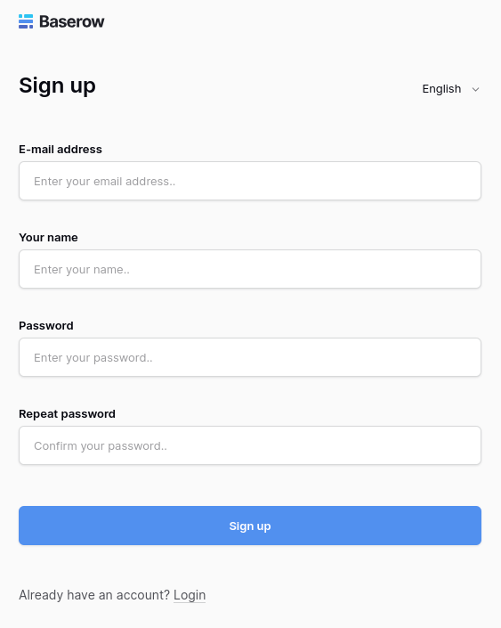
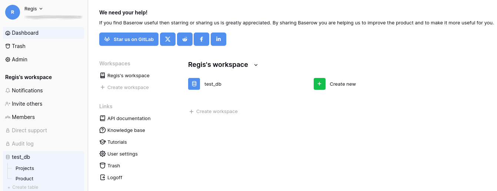
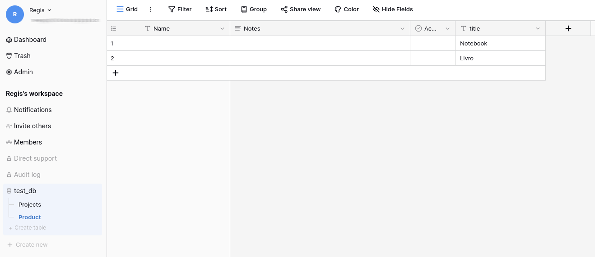
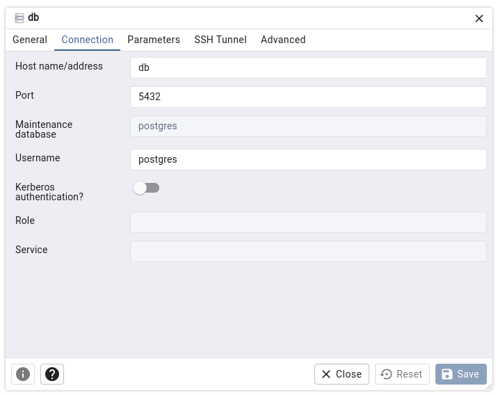

# baserow-example

Example of Baserow with Docker-compose.

Run

```bash
docker-compose up --build -d
```

Access http://localhost:8004


## Baserow

**Documentation:** https://baserow.io/docs/








## PGAdmin

To connect on PostgreSQL with PGAdmin this connection is




## logs

To view logs of container type

```bash
docker container logs -f baserow
```